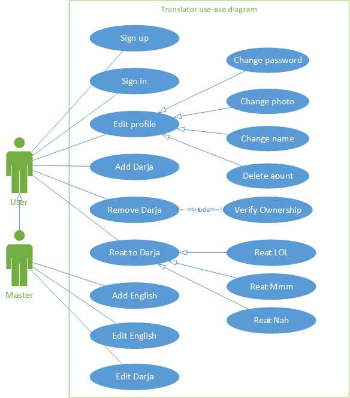

# Daffy Darja
What's the weirdest Wilaya's way of talking? [DRAFT] [JOKE]

[Learning UML]

I really don't know what the hell I'm doing. This shit doesn't sound very boring/serious/academic, I'm doing it wrong OvO

## Title
**Gamification**

***Case study: A crowdsourcing system for building an English-Darja bilingual text corpus***

## Abstract
Due to the pervasive anti-intellectualism in Algeria, relying on the Algerian community's serious collaboration to do anything serious is hopeless. In *My Mean Memoir*, I propose directing Algerians' primitiveness to building a useless dataset. This data can be used in sociolinguistic research, machine translation, and other Natural Language Processing tasks.

## Acknowledgment/Dedication
First and foremost, I have to thank Shinedown, for giving me the *Energy* to be a proud *Outcast*, for teaching me to *Sin with a Grin*, and for teaching me that being unapologetic is all what one needs to succeed in life.

To my friend Abdou, I will always be in debt; you have always been a friend, a supporter, and a mentor.

I dedicate this junk to nobody.

## Concepts
- **Crowdsourcing**
- **Gamification** (competitive)
- **Xenophobia**, **outgroup hostility** (and mockery)
- **Languagism**
- **Self-representation** (and pride)

Just 'Wikipedia' them for God's sake!

## Existing Works
**The Google Translate Community** uses crowd-sourcing to improve its translations. Users gain points by adding translations or
judging others'.

**Tatoeba**, from Wikipedia
> Tatoeba.org is a free collaborative online database of example sentences geared towards foreign language learners. Its name comes from the Japanese term "tatoeba" (例えば　tatoeba), meaning "for example". Unlike other online dictionaries, which focus on words, Tatoeba focuses on translation of complete sentences. In addition, the structure of the database and interface emphasize one-to-many relationships.

**How is our project different from them?** Ours not serious. Period.

## Introduction
It all started after I finished reading a friend's memoir, and done scratching this unreadable shit:

(2018-08-20)

"I Am Dz And I Speak English" is a Facebook group with over 200K members. Most of these members are Algerian and know both Darja (AKA Algerian Arabic) and (to varying degrees) English. They are our target.

In that group, users highly engage with posts of the forms, "How do you say ENGLISH in your Wilaya?" and, "How do you say DARJA in English?"

The whole point is to provoke Algerians to show off their cool ways of talking, to defend their dialects, or to mock others'. Basically using the *concepts* mentioned above.

## Subsystems
### "They Talk Like This"
Browsing English sentences (automatically sorted, or filtered by *tags*), users can **add translations** (Darja); if the Wilaya's number is not specified, the user's Wilaya will be assumed.

Users can **react** to translations: Assessing their accuracy and ridiculousness. Reactions = {LOL/true, Mmm/unsure, Nah/wrong}

### "Guess the Wilaya!"
It serves a similar purpose as 'reactions':

- Given a Darja-English phrase, the user can:
  - Enter the Wilaya's number
  - Skip if cannot decide
  - Mark as spam
- To make it less boring, score the user's performance

### "LOLest List"
To encourage users to participate and compete, we introduced "LOLest List": A dynamically updated list of the Wilayas/users/phrases with the most "LOL" reactions.

## UML Diagrams
*Using Microsoft Visio Pro 2013*

### Wireframe

### Use Cases
Translator

Guesser

### Database

## Implementation
Ain't good with frameworks.

### Development tools
Software and hardware used.

- **Atom** is a code editor developed by GitHub.

- **Vue**, from Wikipedia
> Vue.js is an open-source JavaScript framework for building user interfaces. Integration into projects that use other JavaScript libraries is simplified with Vue because it is designed to be incrementally adoptable. Vue can also function as a web application framework capable of powering advanced single-page applications.

- **Vue Material** is an implementation of Google's Material Design, built for Vue.

- **Google Chrome** for testing the web app:
  - **Android** 6.0 on Condor P6 PRO LTE
  - **Windows** 10 Pro 64-bit on HP 255 G1 Notebook PC (4GB RAM, 1.48 GHz)

## License
WTFPL
